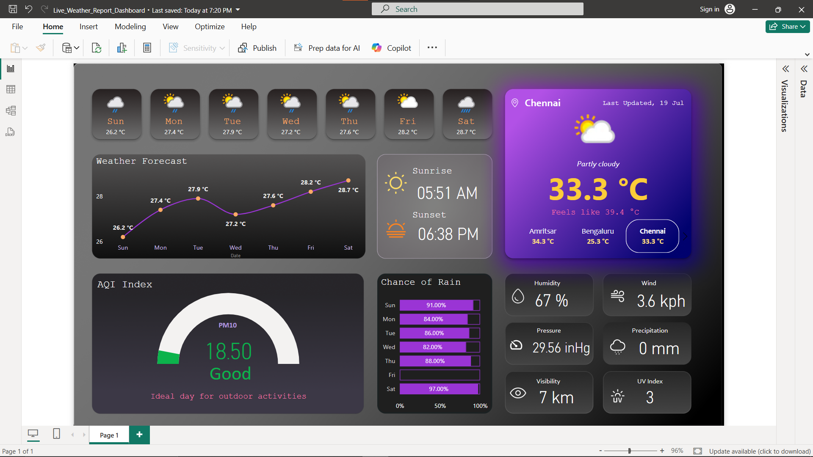
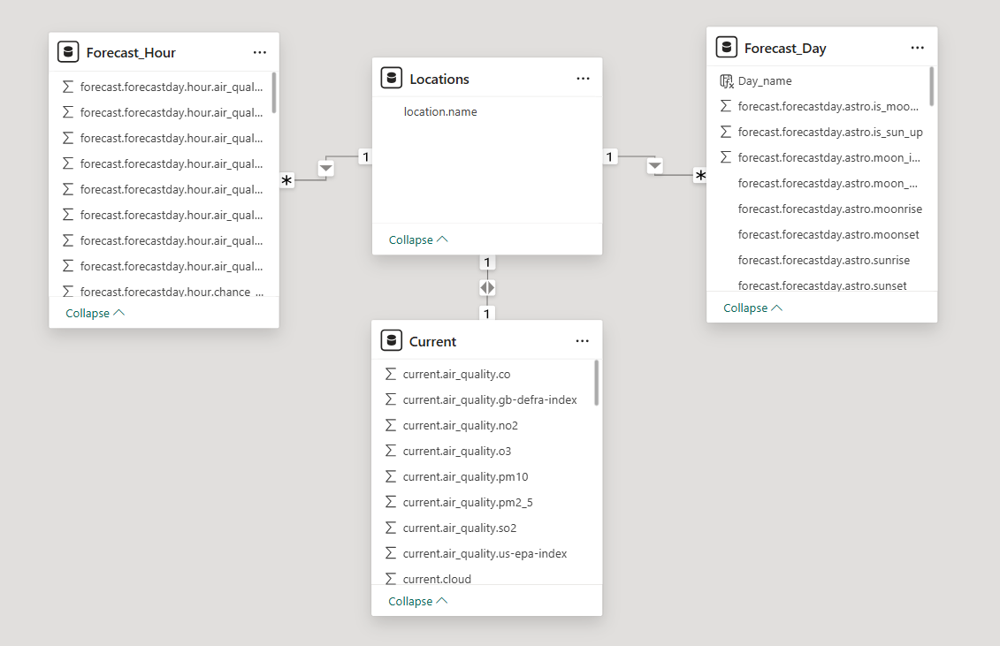

# 🌦️ Live Weather Dashboard in Power BI

This project is a **real-time weather and AQI (Air Quality Index) dashboard** built in Power BI using data from [WeatherAPI](https://www.weatherapi.com/). It helps users track current temperature, humidity, wind speed, and air quality also 7 days weather forecast across different cities with a clean and modern UI.

🔗 **Live GitHub Repo**: [live-weather-dashboard-in-powerbi](https://github.com/SamiranMistry/live-weather-dashboard-in-powerbi)

---

## 📊 Features

- _Current weather stats: temperature, humidity, wind speed_
- _Forecast temperature upto a week_
- _AQI ratings with health suggestions_
- _Dynamic visuals with slicers_
- _Date and day-based insights_
- _Custom Power BI background designed in Figma_

---

## 🖼️ Dashboard Preview

### 📌 Main Dashboard

### 🧩 Data Model

---

### 🎬 Live Demo Preview

---

## 🚀 How to Run

1. Clone or download this repository.
2. Open `Live_Weather_Report_Dashboard.pbix` in **Power BI Desktop**.
3. _(Optional) Replace the API Key in the query if needed._
4. Refresh to load live data.

---

## 🛠️ Tools Used

- **Power BI Desktop**  
- **[WeatherAPI](https://www.weatherapi.com/)** – for fetching live weather and AQI data  
- **Figma** – for background design and layout aesthetics

---

